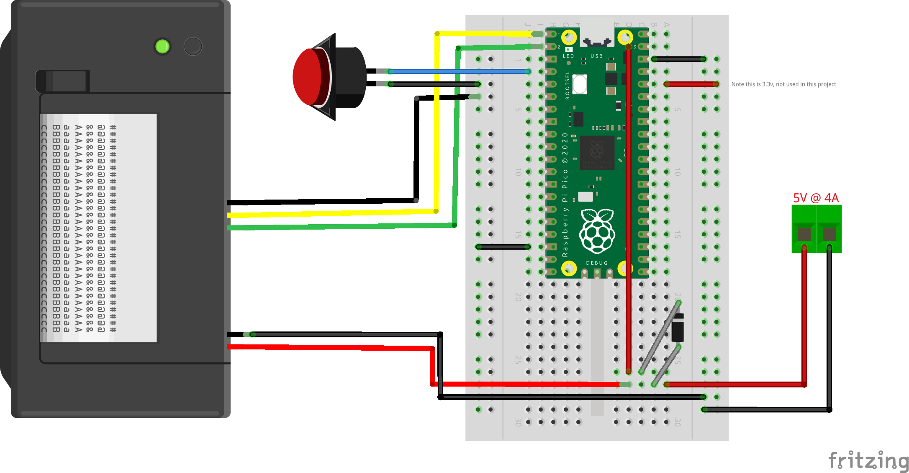

# Pi Pico Ticket Game

This simple build came about as a fun game to play while a group of us waited to see in the year 2025. It can easily be modified to change players, instructions and questions. I used a cigar box for the build, but it can fit into any suitable project box.

The game is designed to be completely stand-alone: you just plug it in to power and it will start. No computer necessary! The interface couldn't be simpler: a big red button for input, and a cheap thermal printer for output.

The thermal printer is an [Epson ESC/POS compatible one I got from Amazon](https://www.amazon.com/Maikrt-Embedded-Microcontroller-Secondary-Development/dp/B09YGVPPWV/ref=sr_1_4). There are many like this available, you can probably easily modify the code and build for another one. This build uses TTL-level UART control - be sure that your printer is set correctly for this (and not RS-232 levels).

An important consideration is the power supply. The printer needs a hefty current to print reliably! You will not be able to power from the Pico. I used a 5V 4A supply connected to the printer, with the positive routed to the Pico's VSYS via a 1N4001 Diode. This allows you to use the Pico's USB while uploading and debugging the code, but will also run 'untethered' when you want to use the game.

The code uses a library I created called epson_thermal.py which is a cut-down class to drive the printer using the ESC/POS standard. It only uses a few commands.

Wiring is fairly simple. The code uses UART0 on GP0 and GP1 to drive the printer. The big red button is connected to GP2 and connects to ground when pressed. Note the code to debounce this button as it was a noisy switch! I used a PCB that has the same layout as a 1/2 size breadboard, which makes transfering from breadboard to a more stable build very easy.

And that's it - I hope this inspires you to build your own game based on this!

